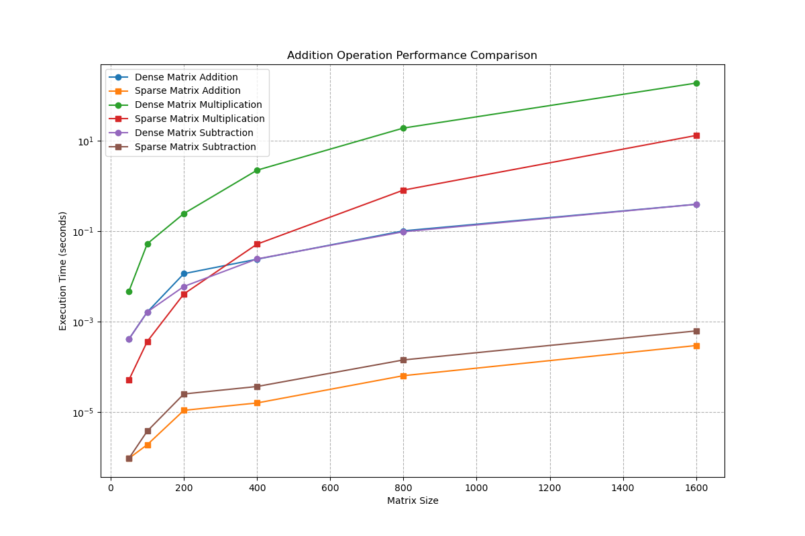

# Pytorch from scratch

This project aims to build a PyTorch-style library that allows students to learn the basics of PyTorch without diving into deep CUDA programming.

## How to Run the Code

To run the movie recommender and get a plot of singular values, execute the following command:

```bash
python MovieRecommender.py
```

To run the entire performance testing suite for our library please run 

```bash
python MatrixPerformanceTest.py
```

## Dependencies

Make sure you have the following dependencies installed:

- Python 3.6 or higher
- NumPy
- SciPy
- mathplotlib

You can run pip install -r requirements.txt

Results:

Plot of basic arithmetic matrix operation efficiency



